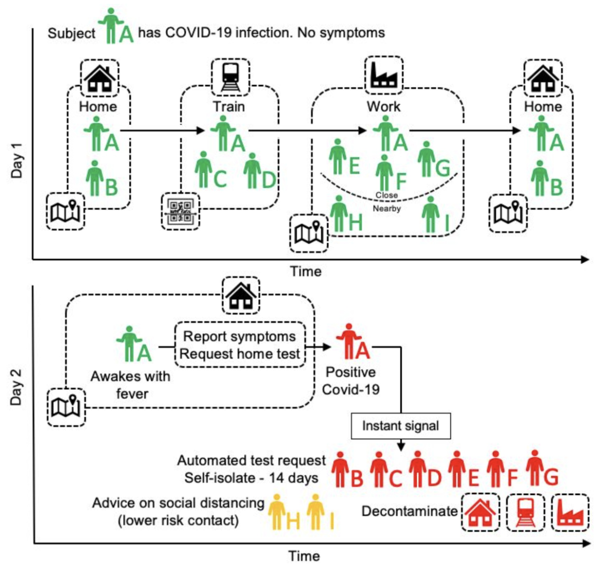
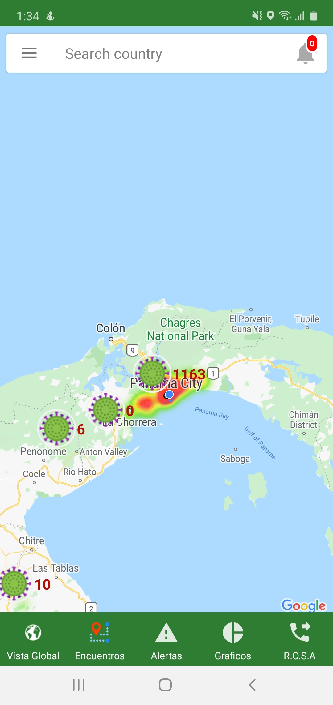
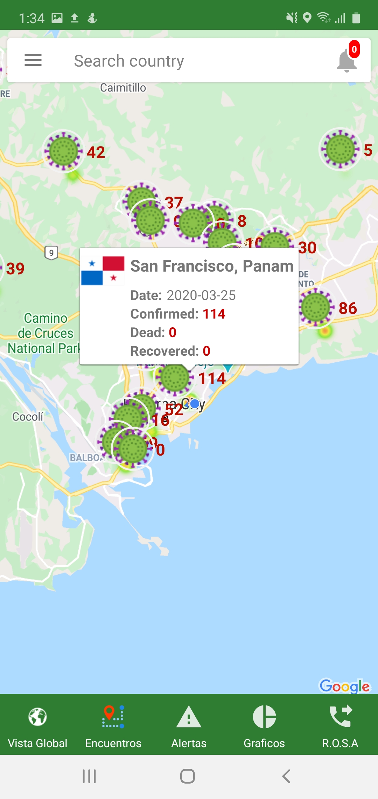
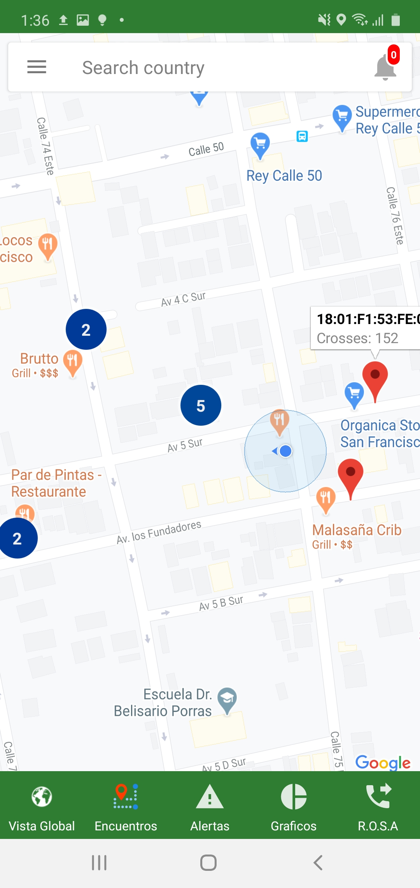
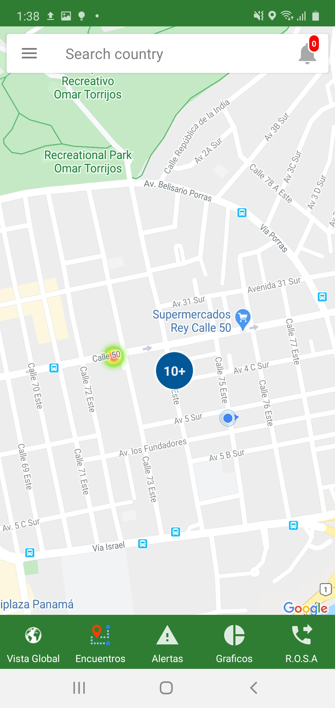
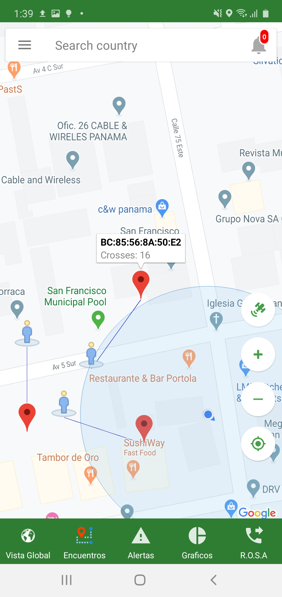
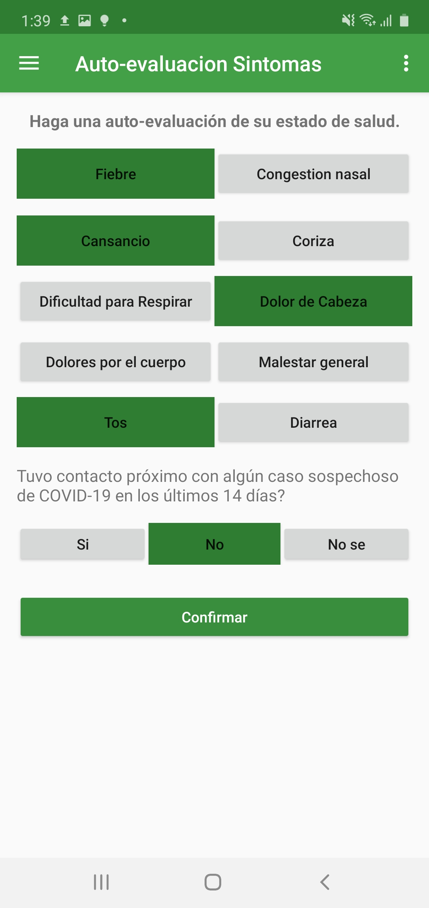
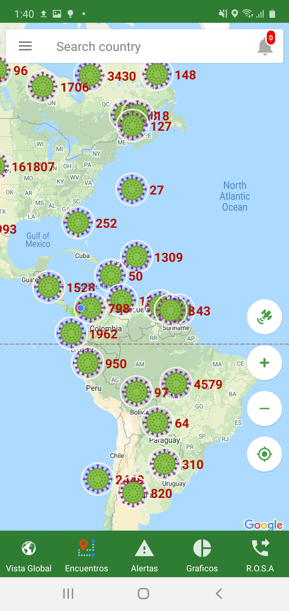

## Bienvenido a URGeo

Note: 
- a paper in English, explaining the app can be founding here <https://medium.com/@edelmorenolemus/urgeo-android-application-to-fight-against-covid19-71028d21a5bf>

________

Esta aplicación verifica si en su trayecto se ha cruzado con personas que han dado positivo a COVID-19. **La aplicación es totalmente segura porque no almacena ninguna información personal, solo datos de su teléfono. Nunca se le pedirá e-mail, número de teléfono, ni ninguna otra información personal.** 

Cada vez que haya una actualización pública de las autoridades sanitarias oficiales con respecto a la ruta de un paciente COVID-19, la aplicación verificará automáticamente la base de datos para identificar si alguno de los usuarios estuvo presente o cerca de un Ubicación "infectada". Si se encuentra una coincidencia, el usuario recibirá una notificación solicitándole que actúe de acuerdo con las pautas pertinentes y se ponga en contacto con las autoridades sanitarias lo antes posible.

### Breve Resumen de la Aplicación

El desarrollo de esta aplicación se basa en una serie de evidencias científicas y análisis de aplicaciones en diferentes regiones del mundo en donde se está logrando la contención de la enfermedad (véase Taiwán, Sud Corea, España, Israel, etc.).

Para minimizar óptimamente el sufrimiento y la devastación económica provocados por COVID19 leemos, entre muchos, que también personajes como Bill Gates consideran, según entrevista del 2 de abril 2020, que “Cuando se alcanza el punto de inflexión de la curva, que para estados Unidos se prevé para principios de mayo, es fundamental rastrear las personas que han estado en contactos con los que ha resultado positivos para optimizar la ubicación de los recursos, de manera que se pueda también decidir cuál es la prioridad del testing, cuales grupos y/o áreas de la población”. 

Pueden verse estas entrevistas en los siguientes links: [https://www.youtube.com/watch?v=4X-KkQeMMSQ](https://www.youtube.com/watch?v=4X-KkQeMMSQ) o [https://www.youtube.com/watch?v=iyFT8qXcOrM](https://www.youtube.com/watch?v=iyFT8qXcOrM)

El siguiente esquema fue publicado por el diario El País el 17 de marzo 2020, y describe perfectamente lo que pretende nuestra aplicación.

[Imagen Tomada del diario El País](https://elpais.com/politica/2020/03/17/actualidad/1584477542_312256.html)

Básicamente este esquema representa a un usuario **A** que tiene interacciones con diferentes usuarios. En el momento que el usuario **A** sea diagnosticado positivo solo somos capaces, hoy dia, de hacerle el test a aquellas personas con las cuales el
usuario **A** recuerda de haber estado en contacto. No podremos saber quienes son las otras con las que se cruzó, por ejemplo, en el mercado, metro, farmacia, trabajo, elevador, etc. y tampoco podremos contactarlas. Con nuestra aplicación esto se resuelve ya que estamos almacenando todos los contactos cercanos que el usuario **A** ha tenido, mediante las interacciones de sus teléfonos inteligentes via Bluetooth.

## Algunas características de la aplicación:
1. Informa instantáneamente a los usuarios la posibilidad que haya estado en contacto con otro usuario resultado posiblemente contagioso. Esto permitirá darles la prioridad a estos usuarios para ser inmediatamente testados y recomendarle, en la espera, de evitar otros contactos hasta el test.

2. Permite a los usuarios de verificar, con un cuestionario digital inteligente, su estado general y de contactar directamente la plataforma R.O.S.A desde dentro del aplicativo.

3. Proporciona a Las Autoridades los canales seguros de información (evitando “Fake News”) para mandar notificaciones, dentro del aplicativo, a toda las partes. Por ejemplo solamente a los mayores de 65 años, o solamente a nacionales o solo a los extranjeros, o a los que se encuentran en una determinada ciudad o área de la ciudad o de una cierta provincia, etc.

4. Muestra los dados numéricos y los cluster oficiales en un mapa interactivo del mundo, con zoom y curvas al nivel de barrio para el país, de Panamá.

## Algunas vistas de la aplicación

     

     

     

